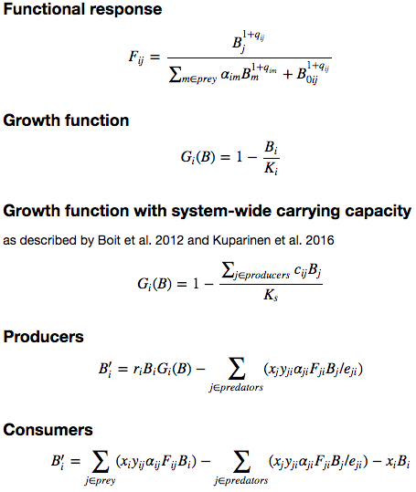

# ATN Simulator

[](https://travis-ci.org/brsaylor/atn-simulator)
[](https://codecov.io/gh/brsaylor/atn-simulator)

ATN Simulator is a Java library for ecological population dynamics simulation
based on allometric trophic network (ATN) models.

Given a [food web][] describing the relationships between predator and prey
species in an ecosystem, and a set of model parameters further characterizing
those species and relationships, a simulation produces as output a time series
dataset representing species populations over time. Populations are represented
as aggregate biomass.

The simulation code in ATN Simulator is used by *[World of Balance][]*
([GitHub][WoB-GitHub]), an ecology simulation game in which players act as
stewards of virtual ecosystems based on the well-studied Serengeti food web.

[food web]: https://en.wikipedia.org/wiki/Food_web
[World of Balance]: http://smurf.sfsu.edu/~wob/
[WoB-GitHub]: https://github.com/worldofbalance/

## Building

A Gradle build script is provided. To build the library and generate a zip file
containing all required JARs and scripts, `cd` into the cloned repository
directory and run the following command:

- `./gradlew distZip` (on Unix-like platforms such as Linux and Mac OS X)
- `gradlew distZip` (on Windows using the gradlew.bat batch file)

This script will take some time to download dependencies and compile the source
code. The zip file can then be found in the `build/distributions` directory.

### Dependencies

ATN Simulator depends on several third-party libraries.
The commands given above should automatically download the dependencies.
However, if you want to obtain the dependencies manually,
see the list in the [build.gradle](build.gradle) file.

## Using the Library

The library classes are contained in the package
`edu.sfsu.worldofbalance.atnsimulator`.

The following is a walkthrough for writing the code to run a basic simulation.

First, create a food web and populate it with producer (i.e. plant) and consumer
(i.e. animal) nodes. A node usually represents a species, but could also
represent some other grouping of organisms. The argument to the *addX* methods
is a *node ID* that should count up from 0.

```java
FoodWeb web = new FoodWeb();
web.addProducerNode(0);
web.addConsumerNode(1);
web.addConsumerNode(2);
```

Add links defining predator-prey relationships. The arguments to `addLink()` are
the prey and predator node IDs, respectively, following the idea that energy in
a food web flows from prey to predator.

```java
web.addLink(0, 1);
web.addLink(0, 2);
```

Initialize the model parameters. Default parameters for a food web are created
as follows:

```java
ModelParameters parameters = new ModelParameters(web);
```

`ModelParameters.Defaults` lists the default parameter values. The parameters
themselves are public member variables of the `ModelParameters` object and can
be set directly. Node-level parameters are represented as arrays indexed by node
ID. For example, to adjust the metabolic rate of consumer node 1:

```java
parameters.metabolicRate[1] = 0.6;
```

Link-level parameters are represented by 2-dimensional arrays indexed by
(predatorNodeId, preyNodeId). For example, to adjust the assimilation efficiency
of producer node 0 by consumer node 2:

```java
parameters.assimilationEfficiency[2][0] = 0.4;
```

With the food web and model parameters initialized, instantiate the model
equations:

```java
ModelEquations equations = new ModelEquations(web, parameters);
```

The equations represent a parameterized ATN model. To run a simulation using
this model, first, set up the simulation parameters:

```java
SimulationParameters simParams = new SimulationParameters();
simParams.stepSize = 0.1;             // Time increment per timestep
simParams.timesteps = 10;             // Number of timesteps to simulate
simParams.stopOnSteadyState = false;  // Disable steady-state detection
```

The simulation also requires an initial state: the biomass of each node at
the start of the simulation:

```java
double[] initialBiomass = {1, 0.1};
```

Run the simulation with the configured simulation parameters, parameterized
model equations, and initial biomass, and retrieve the results:

```java
Simulation simulation = new Simulation(simParams, equations, initialBiomass);
simulation.run();
SimulationResults results = simulation.getResults();
```

The main output of the simulation is the `biomass` field of the
`SimulationResults` object: a 2-dimensional array with one row per timestep and
one column per node. It describes the biomass over time of each node in the food
web.

## Theory and Related Research

Publications from [Pacific Ecoinformatics and Computational Ecology
Lab][foodwebs.org] describe a large body of ecology research relating to ATN
models. In particular, [Williams et al. 2007][], [Berlow 2009 (appendix)][], and
[Boit et al. 2012][] have influenced the model used by ATN Simulator.

[foodwebs.org]: http://foodwebs.org/
[Williams et al. 2007]: http://peacelabfw.appspot.com/pdf/Williams2007Chapter.pdf
[Berlow 2009 (appendix)]: http://peacelabfw.appspot.com/pdf/Berlow2009SIAppen.pdf
[Boit et al. 2012]: http://peacelabfw.appspot.com/pdf/Williams2012EcolLett.pdf

[My blog][Ben's Food Webs] chronicles my research on food webs, ATN models, and
machine learning.

[Ben's Food Webs]: https://bensfoodwebs.wordpress.com/

ATN Simulator implements the following model equations:



The variables are defined as follows. Variables with a single index (except
K<sub>s</sub>) are vectors with one element per node. Variables with two indices
represent link-level parameters, where the first index indicates a predator node
and the second represents a prey node.

| Variable        | Description                           |
|:----------------|:--------------------------------------|
| *B*             | Population density (biomass)          |
| *B'*            | Derivative of biomass                 |
| *x*             | Metabolic rate                        |
| *r*             | Growth rate                           |
| *K*             | Carrying capacity                     |
| *K<sub>s</sub>* | System carrying capacity              |
| *y*             | Maximum ingestion rate                |
| *&alpha;*       | Relative half saturation density      |
| *e*             | Assimilation efficiency               |
| *q*             | Functional response control parameter |
| *B<sub>0</sub>* | Half saturation density               |

## Acknowledgments

Many thanks to the following people who helped me understand ATN models and
otherwise provided direct or indirect support to this effort: Anagha Kulkarni,
Ilmi Yoon, Jonathan Stern, Justina Cotter, Paul Yoon, Neo Martinez, Rich
Williams

## Author

Ben Saylor
